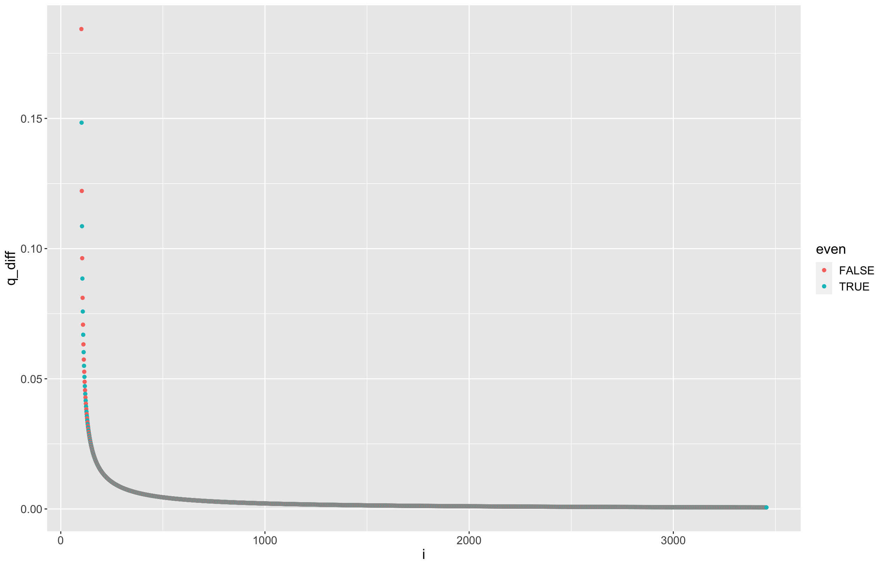

# Refutation of the Collatz conjecture
Imagine that we have a number x that never collapses. First 5 elements of the sequence for it would be:
```
f(1.00x + 0.00) = 3.0(1.00x + 0.00) + 1 = 3.00x + 1.00
f(3.00x + 1.00) = 0.5(3.00x + 1.00) + 0 = 1.50x + 0.50
f(1.50x + 0.50) = 3.0(1.50x + 0.50) + 1 = 4.50x + 2.50
f(4.50x + 2.50) = 0.5(4.50x + 2.50) + 0 = 2.25x + 1.25
f(2.25x + 1.25) = 3.0(2.25x + 1.25) + 1 = 6.75x + 4.75
```
It's obvious that the numbers in the sequence can be represented with the formula:
```
f(x_n) = k_n * x + b_n
```
These numbers can be easily generated:
```r
generate_k <- function(n) {
    if (n <= 0) {
        stop("Incorrect input.")
    }
    sequence <- numeric(n)
    sequence[1] <- 3
    for (i in 2:n) {
        if (i %% 2 == 0) {
            sequence[i] <- sequence[i-1] / 2
        } else {
            sequence[i] <- sequence[i-1] * 3
        }
    }
    return(sequence)
}

generate_b <- function(n) {
    if (n <= 0) {
        stop("Incorrect input.")
    }
    sequence <- numeric(n)
    sequence[1] <- 1
    for (i in 2:n) {
        if (i %% 2 == 0) {
            sequence[i] <- sequence[i-1] / 2
        } else {
            sequence[i] <- sequence[i-1] * 3 + 1
        }
    }
    return(sequence)
}
```
Let's generate the first 3456 datapoints and plot them:

Get the logarithm:


Separate even and uneven numbers:

If you look closer to the beginning of the graph, it is clear that it is not a linear function:

But is there a part of it that becomes linear somewhere close to -> ∞?

To check this, let's fit linear models `m * x_n + q` to each 100 elements for even and uneven rows:


Look at the differences between each n and m (ignoring those with difference of zero):



Obviously, differences become 0 with time. That means that from some point, the `log(k * x_n + b)` can be represented as a linear function `m * x_n + q`.

And since it is a linear function, we can definitely find a natural x_n that solves it, what refutes the Collatz conjecture.
